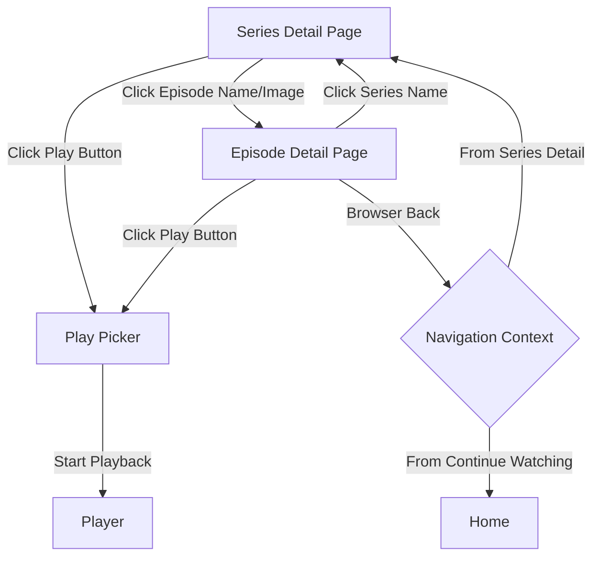

# تصميم صفحة تفاصيل الحلقة (Episode Detail Page Design)

## Overview

### Purpose
صفحة تفاصيل الحلقة هي صفحة عرض جديدة في تطبيق Harbor توفر معلومات شاملة عن حلقات المسلسلات قبل التشغيل. تعمل كطبقة وسيطة بين عرض قائمة الحلقات وصفحة اختيار الستريم، مما يحسن تجربة المستخدم من خلال توفير سياق غني قبل اتخاذ قرار المشاهدة.

### Objectives
1. **Rich Episode Information**: Display comprehensive episode metadata from TMDB API including title, description, ratings, stills, and guest stars
2. **Consistent Visual Experience**: Reuse existing components from detail.tsx to maintain design consistency across the application
3. **Flexible Navigation**: Support multiple access patterns (direct links, episode lists, continue watching)
4. **Robust Fallback**: Handle data source failures gracefully with Cinemeta fallback

### Key Features
- Dedicated route: `/detail/:seriesId/episode/:season/:episode`
- Hero section with episode still/backdrop
- Episode metadata display (title, description, rating, air date, runtime)
- Episode stills gallery (up to 12 images)
- Guest stars section with cast cards
- Navigation to series detail page
- Play button respecting autoPlay settings

### Scope
**In Scope:**
- New episode detail view component
- TMDB API integration for episode data
- Episode stills gallery
- Guest stars display
- Route and navigation updates
- Episode card component updates
- Component reuse from detail.tsx

**Out of Scope:**
- Playback experience modifications
- Social features (comments, reviews)
- Advanced watch analytics
- Smart episode recommendations


## Architecture

### High-Level Architecture

```
┌──────────────────────────────────────────────────────────────┐
│                      View Layer                               │
│  ┌──────────────────────────────────────────────────────┐   │
│  │        EpisodeDetailView Component                    │   │
│  │  • Hero Section (reused from detail.tsx)            │   │
│  │  • Episode Info Section                              │   │
│  │  • Episode Stills Gallery                            │   │
│  │  • Guest Stars Section                               │   │
│  └──────────────────────────────────────────────────────┘   │
└──────────────────────────────────────────────────────────────┘
                          │
                          ▼
┌──────────────────────────────────────────────────────────────┐
│                  Navigation Layer                             │
│  ┌──────────────────────────────────────────────────────┐   │
│  │       ViewProvider (lib/view.tsx)                     │   │
│  │  • Frame: { kind: "episode-detail", ... }           │   │
│  │  • openEpisodeDetail() helper                        │   │
│  │  • Navigation state management                       │   │
│  └──────────────────────────────────────────────────────┘   │
└──────────────────────────────────────────────────────────────┘
                          │
                          ▼
┌──────────────────────────────────────────────────────────────┐
│                      Data Layer                               │
│  ┌──────────────────┐        ┌──────────────────────┐       │
│  │  TMDB Provider   │   →    │  Cinemeta Provider   │       │
│  │  (Primary)       │        │  (Fallback)          │       │
│  │  • Episode meta  │        │  • Basic episode info│       │
│  │  • Guest stars   │        │  • Episode thumbnail │       │
│  │  • Stills images │        │  • Episode videos    │       │
│  └──────────────────┘        └──────────────────────┘       │
└──────────────────────────────────────────────────────────────┘
                          │
                          ▼
┌──────────────────────────────────────────────────────────────┐
│                    Caching Layer                              │
│  • Episode metadata cache (24 hours TTL)                     │
│  • Image preloading and optimization                         │
│  • Series metadata cache                                     │
└──────────────────────────────────────────────────────────────┘
```

### Navigation Flow




### Component Reuse Strategy

This design maximizes component reuse from `detail.tsx` to maintain consistency:

| Component | Source | Usage in Episode Detail |
|-----------|--------|------------------------|
| Hero Section Pattern | detail.tsx | Background image with gradients, content overlay |
| TitlePlate | detail.tsx | Display episode title (S{season}E{episode} - {name}) |
| Pill | detail.tsx | Show metadata (air date, rating, runtime) |
| HeroRatings | detail.tsx | Display episode rating |
| Synopsis | detail.tsx | Show episode overview/description |
| CastCard | detail.tsx | Display guest stars |
| MediaGallery | detail.tsx | Episode stills gallery |
| PlayModeHint | detail.tsx | Play button hint tooltip |

### Technology Stack
- **Framework**: React 18 with TypeScript
- **State Management**: React hooks (useState, useEffect, useMemo)
- **Data Fetching**: Async/await with fetch API
- **Caching**: In-memory Map with TTL
- **Routing**: View-based navigation (ViewProvider)
- **Styling**: Tailwind CSS utility classes
- **API**: TMDB API v3 with Cinemeta fallback


## Components and Interfaces

### EpisodeDetailView (Main Component)

**File**: `src/views/episode-detail.tsx`

**Purpose**: Main component that orchestrates the episode detail page, handling data fetching, state management, and rendering all sections.

```typescript
interface EpisodeDetailViewProps {
  seriesId: string;
  season: number;
  episode: number;
  seriesMeta?: Meta; // Optional: avoid refetching if coming from series page
}

export function EpisodeDetailView({
  seriesId,
  season,
  episode,
  seriesMeta: initialSeriesMeta,
}: EpisodeDetailViewProps) {
  // State
  const [seriesMeta, setSeriesMeta] = useState<Meta | null>(initialSeriesMeta || null);
  const [episodeData, setEpisodeData] = useState<EpisodeDetail | null>(null);
  const [loading, setLoading] = useState(true);
  const [error, setError] = useState<string | null>(null);
  
  // Hooks
  const { settings } = useSettings();
  const { openPicker, openMeta, goBack } = useView();
  const t = useT();
  
  // Effects for data fetching
  // Render logic
}
```

**Responsibilities**:
- Fetch series metadata if not provided
- Fetch episode details from TMDB/Cinemeta
- Handle loading and error states
- Coordinate between sections
- Manage navigation interactions


### EpisodeHero Component

**Purpose**: Display hero section with episode backdrop, title, and primary action button.

```typescript
interface EpisodeHeroProps {
  episodeTitle: string;
  episodeNumber: number;
  seasonNumber: number;
  seriesName: string;
  seriesLogo?: string;
  backdrop?: string;
  still?: string;
  rating?: number;
  airDate?: string;
  runtime?: number;
  onPlay: () => void;
  onSeriesClick: () => void;
  loading?: boolean;
}

export function EpisodeHero(props: EpisodeHeroProps)
```

**Key Features**:
- Reuses hero section layout pattern from detail.tsx
- Displays series name as clickable breadcrumb
- Shows episode title in format "S{season}E{episode} - {title}"
- Metadata pills for air date, rating, runtime
- Primary play button with PlayModeHint
- Gradient overlays for text readability

### EpisodeInfoSection Component

**Purpose**: Display detailed episode information and description.

```typescript
interface EpisodeInfoSectionProps {
  overview: string;
  season: number;
  episode: number;
  airDate?: string;
  runtime?: number;
  voteAverage?: number;
  voteCount?: number;
}

export function EpisodeInfoSection(props: EpisodeInfoSectionProps)
```

**Features**:
- Uses Synopsis component for episode overview
- Expandable description if text is long
- Formatted metadata display
- Responsive layout


### EpisodeStillsGallery Component

**Purpose**: Display gallery of episode stills with lightbox functionality.

```typescript
interface EpisodeStillsGalleryProps {
  stills: StillImage[];
  episodeTitle: string;
}

export function EpisodeStillsGallery(props: EpisodeStillsGalleryProps)
```

**Features**:
- Reuses MediaGallery component from detail.tsx
- Displays up to 12 stills
- Lazy loading for performance
- Lightbox view on click
- Grid layout with responsive sizing

### GuestStarsSection Component

**Purpose**: Display guest stars who appeared in the episode.

```typescript
interface GuestStarsSectionProps {
  guestStars: GuestStar[];
}

export function GuestStarsSection(props: GuestStarsSectionProps)
```

**Features**:
- Reuses CastCard component from detail.tsx
- Horizontal scrollable row
- Links to person detail pages
- Shows character names
- Profile images with fallback

### Updated Episode Card Components

**Files to modify**:
- `src/views/detail/series-episode-row.tsx` (EpisodeRow)
- `src/views/detail/episode-strip.tsx` (EpisodeStrip)
- `src/views/detail/cinemeta-episodes.tsx` (CinemetaEpisodeRow)

**Key Changes**:
```typescript
// Add separate click handlers
const handleEpisodeClick = () => {
  openEpisodeDetail(meta.id, season, episode, meta);
};

const handlePlayClick = (e: React.MouseEvent) => {
  e.stopPropagation();
  openPicker(meta, playEpisode, { autoPlay: settings.instantPlay });
};

// Maintain distinct clickable areas
// - Episode name/thumbnail → Episode Detail Page
// - Play button → Play Picker (direct)
```


## Data Models

### EpisodeDetail Type

Complete episode information fetched from TMDB API.

```typescript
export type EpisodeDetail = {
  id: number;
  episodeNumber: number;
  seasonNumber: number;
  name: string;
  overview: string;
  stillPath: string | null;
  airDate: string | null;
  runtime: number | null;
  voteAverage: number | null;
  voteCount: number;
  guestStars: GuestStar[];
  crew: CrewMember[];
  stills: StillImage[];
};
```

### GuestStar Type

Guest actor information for the episode.

```typescript
export type GuestStar = {
  id: number;
  name: string;
  character: string;
  order: number;
  profilePath: string | null;
};
```

### CrewMember Type

```typescript
export type CrewMember = {
  id: number;
  name: string;
  job: string;
  department: string;
  profilePath: string | null;
};
```

### StillImage Type

Episode still image metadata from TMDB.

```typescript
export type StillImage = {
  aspectRatio: number;
  filePath: string;
  height: number;
  width: number;
  voteAverage: number;
};
```


### EpisodeCacheEntry Type

Cache entry for episode data with TTL.

```typescript
type EpisodeCacheEntry = {
  data: EpisodeDetail;
  timestamp: number;
  seriesId: string;
};

// Cache key format: `episode:${seriesId}:${season}:${episode}`
const CACHE_DURATION_MS = 24 * 60 * 60 * 1000; // 24 hours
```

### ViewProvider Frame Extension

Extend Frame union type in `lib/view.tsx` to support episode detail navigation.

```typescript
export type Frame = 
  | ... // existing frames
  | { 
      kind: "episode-detail"; 
      seriesId: string; 
      season: number; 
      episode: number;
      seriesMeta?: Meta; // optional to avoid refetching
    };
```

### TMDB API Response Types

Raw response types from TMDB API for type safety.

```typescript
type TmdbEpisodeResponse = {
  id: number;
  episode_number: number;
  season_number: number;
  name: string;
  overview: string;
  still_path: string | null;
  air_date: string | null;
  runtime: number | null;
  vote_average: number | null;
  vote_count: number;
  credits: {
    cast: Array<{
      id: number;
      name: string;
      character: string;
      order: number;
      profile_path: string | null;
    }>;
    crew: Array<{
      id: number;
      name: string;
      job: string;
      department: string;
      profile_path: string | null;
    }>;
    guest_stars: Array<{
      id: number;
      name: string;
      character: string;
      order: number;
      profile_path: string | null;
    }>;
  };
  images: {
    stills: Array<{
      aspect_ratio: number;
      file_path: string;
      height: number;
      width: number;
      vote_average: number;
    }>;
  };
};
```


## API Integration

### TMDB Episode Details Endpoint

**New file**: `src/lib/providers/tmdb/tmdb-episode-details.ts`

```typescript
export async function tmdbEpisodeDetail(
  apiKey: string,
  tvId: number,
  seasonNumber: number,
  episodeNumber: number,
): Promise<EpisodeDetail | null> {
  try {
    const url = `https://api.themoviedb.org/3/tv/${tvId}/season/${seasonNumber}/episode/${episodeNumber}`;
    const params = new URLSearchParams({
      api_key: apiKey,
      append_to_response: 'credits,images',
    });
    
    const response = await fetch(`${url}?${params}`);
    if (!response.ok) return null;
    
    const data: TmdbEpisodeResponse = await response.json();
    
    return {
      id: data.id,
      episodeNumber: data.episode_number,
      seasonNumber: data.season_number,
      name: data.name,
      overview: data.overview,
      stillPath: data.still_path,
      airDate: data.air_date,
      runtime: data.runtime,
      voteAverage: data.vote_average,
      voteCount: data.vote_count,
      guestStars: (data.credits?.guest_stars || []).map(star => ({
        id: star.id,
        name: star.name,
        character: star.character,
        order: star.order,
        profilePath: star.profile_path,
      })),
      crew: (data.credits?.crew || []).map(member => ({
        id: member.id,
        name: member.name,
        job: member.job,
        department: member.department,
        profilePath: member.profile_path,
      })),
      stills: (data.images?.stills || [])
        .slice(0, 12)
        .map(still => ({
          aspectRatio: still.aspect_ratio,
          filePath: still.file_path,
          height: still.height,
          width: still.width,
          voteAverage: still.vote_average || 0,
        })),
    };
  } catch (error) {
    console.error('Failed to fetch TMDB episode details:', error);
    return null;
  }
}
```


### Caching Strategy

**New file**: `src/lib/providers/tmdb/tmdb-episode-cache.ts`

```typescript
const CACHE_DURATION_MS = 24 * 60 * 60 * 1000; // 24 hours
const episodeCache = new Map<string, EpisodeCacheEntry>();

function getCacheKey(seriesId: string, season: number, episode: number): string {
  return `episode:${seriesId}:${season}:${episode}`;
}

export function getCachedEpisode(
  seriesId: string,
  season: number,
  episode: number,
): EpisodeDetail | null {
  const key = getCacheKey(seriesId, season, episode);
  const cached = episodeCache.get(key);
  
  if (!cached) return null;
  
  const age = Date.now() - cached.timestamp;
  if (age > CACHE_DURATION_MS) {
    episodeCache.delete(key);
    return null;
  }
  
  return cached.data;
}

export function cacheEpisode(
  seriesId: string,
  season: number,
  episode: number,
  data: EpisodeDetail,
): void {
  const key = getCacheKey(seriesId, season, episode);
  episodeCache.set(key, {
    data,
    timestamp: Date.now(),
    seriesId,
  });
  
  // Optional: Limit cache size
  if (episodeCache.size > 100) {
    const firstKey = episodeCache.keys().next().value;
    if (firstKey) episodeCache.delete(firstKey);
  }
}

export function clearEpisodeCache(): void {
  episodeCache.clear();
}
```


### Cinemeta Fallback

**New file**: `src/lib/cinemeta-episode.ts`

```typescript
export async function cinemetaEpisodeDetail(
  meta: Meta,
  season: number,
  episode: number,
): Promise<Partial<EpisodeDetail> | null> {
  try {
    const video = meta.videos?.find(
      v => v.season === season && v.episode === episode
    );
    
    if (!video) return null;
    
    return {
      episodeNumber: episode,
      seasonNumber: season,
      name: video.name || video.title || `Episode ${episode}`,
      overview: '', // Cinemeta doesn't provide episode descriptions
      stillPath: video.thumbnail || null,
      airDate: video.released || video.firstAired || null,
      runtime: null,
      voteAverage: null,
      voteCount: 0,
      guestStars: [],
      crew: [],
      stills: video.thumbnail ? [{
        aspectRatio: 16/9,
        filePath: video.thumbnail,
        height: 720,
        width: 1280,
        voteAverage: 0,
      }] : [],
    };
  } catch (error) {
    console.error('Failed to get Cinemeta episode data:', error);
    return null;
  }
}
```


### Unified Data Fetcher

**New file**: `src/lib/episode-data-fetcher.ts`

```typescript
export async function fetchEpisodeData(
  seriesId: string,
  seriesMeta: Meta,
  season: number,
  episode: number,
  settings: Settings,
): Promise<EpisodeDetail | null> {
  // 1. Check cache first
  const cached = getCachedEpisode(seriesId, season, episode);
  if (cached) return cached;
  
  // 2. Try TMDB
  if (settings.tmdbKey) {
    try {
      const tmdbId = await extractTmdbId(seriesId, seriesMeta);
      if (tmdbId) {
        const tmdbData = await tmdbEpisodeDetail(
          settings.tmdbKey,
          tmdbId,
          season,
          episode,
        );
        
        if (tmdbData) {
          cacheEpisode(seriesId, season, episode, tmdbData);
          return tmdbData;
        }
      }
    } catch (tmdbError) {
      console.warn('TMDB fetch failed, falling back to Cinemeta:', tmdbError);
    }
  }
  
  // 3. Fallback to Cinemeta
  try {
    const cinemetaData = await cinemetaEpisodeDetail(seriesMeta, season, episode);
    
    if (cinemetaData) {
      const completeData: EpisodeDetail = {
        id: 0,
        ...cinemetaData,
        name: cinemetaData.name!,
        overview: cinemetaData.overview!,
        guestStars: [],
        crew: [],
        stills: cinemetaData.stills || [],
      } as EpisodeDetail;
      
      cacheEpisode(seriesId, season, episode, completeData);
      return completeData;
    }
  } catch (cinemetaError) {
    console.error('Cinemeta fetch failed:', cinemetaError);
  }
  
  return null;
}

async function extractTmdbId(
  seriesId: string,
  meta: Meta,
): Promise<number | null> {
  if (seriesId.startsWith('tmdb:tv:')) {
    return Number(seriesId.slice(8));
  }
  
  if (seriesId.startsWith('tt')) {
    // Use existing tmdbImdbId function
    return await tmdbImdbId(settings.tmdbKey, { id: seriesId, type: 'series' });
  }
  
  return null;
}
```


## Routing and Navigation

### ViewProvider Updates

**File**: `src/lib/view.tsx`

#### Add Frame Type

```typescript
export type Frame = 
  | ... // existing frames
  | { 
      kind: "episode-detail"; 
      seriesId: string; 
      season: number; 
      episode: number;
      seriesMeta?: Meta;
    };
```

#### Add Navigation State and Helpers

```typescript
type ViewValue = {
  // ... existing properties
  
  episodeDetail: {
    seriesId: string;
    season: number;
    episode: number;
    seriesMeta?: Meta;
  } | null;
  
  openEpisodeDetail: (
    seriesId: string, 
    season: number, 
    episode: number,
    seriesMeta?: Meta
  ) => void;
};
```

#### Implementation

```typescript
export function ViewProvider({ children }: { children: ReactNode }) {
  // ... existing state
  
  const openEpisodeDetail = useCallback((
    seriesId: string,
    season: number,
    episode: number,
    seriesMeta?: Meta
  ) => {
    setStack(s => pushFrame(s, {
      kind: "episode-detail",
      seriesId,
      season,
      episode,
      seriesMeta,
    }));
  }, []);
  
  const episodeDetail = useMemo(() => {
    if (top.kind === "episode-detail") {
      return {
        seriesId: top.seriesId,
        season: top.season,
        episode: top.episode,
        seriesMeta: top.seriesMeta,
      };
    }
    return null;
  }, [top]);
  
  return (
    <Ctx.Provider value={{
      // ... existing values
      episodeDetail,
      openEpisodeDetail,
    }}>
      {children}
    </Ctx.Provider>
  );
}
```


### App.tsx Integration

**File**: `src/App.tsx`

#### Import Component

```typescript
const EpisodeDetailView = lazy(() => 
  import("@/views/episode-detail").then((m) => ({ default: m.EpisodeDetailView }))
);
```

#### Add to Shell Component

```typescript
function Shell() {
  const { 
    topKind, 
    episodeDetail,
    stackKinds,
    // ... other state
  } = useView();
  
  const episodeDetailTop = topKind === "episode-detail";
  const episodeDetailAlive = useKeepAlive(
    episodeDetailTop,
    episodeDetail !== null,
    stackKinds.includes("episode-detail")
  );
  
  return (
    <div className="relative flex h-full">
      {/* ... existing chrome */}
      
      <div className={`relative flex min-h-0 min-w-0 flex-1 flex-col ${playerActive ? "invisible" : ""}`}>
        {/* ... existing views */}
        
        {episodeDetailAlive && episodeDetail && (
          <div className={layer(episodeDetailTop)}>
            <Suspense fallback={null}>
              <EpisodeDetailView 
                key={`episode-${episodeDetail.seriesId}-${episodeDetail.season}-${episodeDetail.episode}`}
                seriesId={episodeDetail.seriesId}
                season={episodeDetail.season}
                episode={episodeDetail.episode}
                seriesMeta={episodeDetail.seriesMeta}
              />
            </Suspense>
          </div>
        )}
        
        {/* ... rest of views */}
      </div>
    </div>
  );
}
```


### Episode Card Updates

#### EpisodeRow Component

**File**: `src/views/detail/series-episode-row.tsx`

```typescript
export function EpisodeRow({
  meta,
  ep,
  progress,
  cinemetaThumbnail,
  spoiler,
  onContextMenu,
}: EpisodeRowProps) {
  const { openPicker, openEpisodeDetail } = useView();
  const { settings } = useSettings();
  
  const playEpisode = {
    season: ep.seasonNumber,
    episode: ep.episodeNumber,
    name: ep.name || undefined,
    still,
    overview: ep.overview || undefined,
  };
  
  return (
    <div className="group flex gap-6 rounded-2xl px-4 py-5">
      {/* Main clickable area - navigates to detail page */}
      <button
        onClick={() => openEpisodeDetail(meta.id, ep.seasonNumber, ep.episodeNumber, meta)}
        className="flex min-w-0 flex-1 gap-6 text-start"
      >
        <div className="relative w-[200px] shrink-0">
          {/* Thumbnail with hover overlay */}
          <Poster src={still} seed={String(ep.id)} ratio="landscape" />
          <div className="absolute inset-0 flex items-center justify-center bg-canvas/40 opacity-0 transition-opacity group-hover:opacity-100">
            <div className="flex h-12 w-12 items-center justify-center rounded-full bg-ink/10 text-ink backdrop-blur-sm">
              <Eye size={20} />
            </div>
          </div>
          {/* Episode number badge */}
          <span className="absolute start-2 top-2 rounded-md bg-canvas/95 px-1.5 py-0.5 text-[11px] font-semibold">
            {ep.episodeNumber}
          </span>
        </div>
        
        <div className="flex min-w-0 flex-1 flex-col gap-1.5">
          <h4 className="truncate text-[16px] font-semibold text-ink">
            {ep.name || `Episode ${ep.episodeNumber}`}
          </h4>
          <p className="text-[12px] text-ink-subtle">
            S{ep.seasonNumber} E{ep.episodeNumber} · {ep.runtime} min
          </p>
          {ep.overview && (
            <p className="line-clamp-2 text-[13.5px] text-ink-muted">
              {ep.overview}
            </p>
          )}
        </div>
      </button>
      
      {/* Separate play button */}
      <button
        onClick={(e) => {
          e.stopPropagation();
          openPicker(meta, playEpisode, { autoPlay: settings.instantPlay });
        }}
        className="flex h-12 w-12 shrink-0 items-center justify-center rounded-full border border-edge bg-elevated/60 hover:bg-elevated"
      >
        <Play size={18} fill="currentColor" />
      </button>
      
      <EpisodeDownloadButton meta={meta} episode={playEpisode} />
    </div>
  );
}
```


#### EpisodeStrip Component

**File**: `src/views/detail/episode-strip.tsx`

```typescript
function EpisodeStripCard({
  meta,
  ep,
  progress,
  cinemetaThumbnail,
  spoiler,
  onContextMenu,
}: EpisodeStripCardProps) {
  const { openPicker, openEpisodeDetail } = useView();
  const { settings } = useSettings();
  
  const still = tmdbStill || cinemetaThumbnail;
  const playEpisode = {
    season: ep.seasonNumber,
    episode: ep.episodeNumber,
    name: ep.name || undefined,
    still,
    overview: ep.overview || undefined,
  };
  
  return (
    <div className="group relative w-[244px] shrink-0">
      {/* Main card - click to detail */}
      <button
        onClick={() => openEpisodeDetail(meta.id, ep.seasonNumber, ep.episodeNumber, meta)}
        className="flex w-full flex-col gap-2.5 text-start"
      >
        <div className="relative aspect-video overflow-hidden rounded-xl">
          <Poster src={still} seed={String(ep.id)} ratio="landscape" />
          
          {/* Episode number badge */}
          <span className="absolute start-2 top-2 rounded-md bg-canvas/95 px-1.5 py-0.5 text-[11px] font-semibold">
            {ep.episodeNumber}
          </span>
          
          {progress.watched && (
            <span className="absolute end-2 top-2 flex h-6 w-6 items-center justify-center rounded-full bg-emerald-400/22">
              <Check size={12} strokeWidth={3} />
            </span>
          )}
        </div>
        
        <div className="flex flex-col gap-0.5 px-0.5">
          <span className="truncate text-[13.5px] font-semibold text-ink">
            {ep.name || `Episode ${ep.episodeNumber}`}
          </span>
          <span className="text-[11.5px] text-ink-subtle">
            S{ep.seasonNumber} E{ep.episodeNumber}
          </span>
        </div>
      </button>
      
      {/* Play button overlay */}
      <button
        onClick={(e) => {
          e.stopPropagation();
          openPicker(meta, playEpisode, { autoPlay: settings.instantPlay });
        }}
        className="absolute inset-0 flex items-center justify-center bg-canvas/40 opacity-0 transition-opacity group-hover:opacity-100"
      >
        <div className="flex h-11 w-11 items-center justify-center rounded-full bg-ink text-canvas">
          <Play size={16} fill="currentColor" />
        </div>
      </button>
    </div>
  );
}
```


## Error Handling

### Multi-Level Error Handling Strategy

#### 1. Data Fetching Level

```typescript
async function fetchEpisodeData(
  seriesId: string,
  seriesMeta: Meta,
  season: number,
  episode: number,
  settings: Settings,
): Promise<EpisodeDetail | null> {
  try {
    // Try cache
    const cached = getCachedEpisode(seriesId, season, episode);
    if (cached) return cached;
    
    // Try TMDB
    if (settings.tmdbKey) {
      try {
        const tmdbId = await extractTmdbId(seriesId, seriesMeta);
        if (tmdbId) {
          const tmdbData = await tmdbEpisodeDetail(
            settings.tmdbKey,
            tmdbId,
            season,
            episode,
          );
          
          if (tmdbData) {
            cacheEpisode(seriesId, season, episode, tmdbData);
            return tmdbData;
          }
        }
      } catch (tmdbError) {
        console.warn('TMDB fetch failed, falling back:', tmdbError);
        // Continue to fallback
      }
    }
    
    // Try Cinemeta fallback
    try {
      const cinemetaData = await cinemetaEpisodeDetail(
        seriesMeta,
        season,
        episode,
      );
      
      if (cinemetaData) {
        const completeData = {
          id: 0,
          ...cinemetaData,
          guestStars: [],
          crew: [],
          stills: cinemetaData.stills || [],
        } as EpisodeDetail;
        
        cacheEpisode(seriesId, season, episode, completeData);
        return completeData;
      }
    } catch (cinemetaError) {
      console.error('Cinemeta fallback failed:', cinemetaError);
    }
    
    return null;
  } catch (error) {
    console.error('Failed to fetch episode data:', error);
    return null;
  }
}
```


#### 2. Component Level Error Handling

```typescript
export function EpisodeDetailView(props: EpisodeDetailViewProps) {
  const [error, setError] = useState<string | null>(null);
  const [loading, setLoading] = useState(true);
  const t = useT();
  
  useEffect(() => {
    let cancelled = false;
    
    (async () => {
      setLoading(true);
      setError(null);
      
      try {
        const data = await fetchEpisodeData(/* ... */);
        
        if (!cancelled) {
          if (data) {
            setEpisodeData(data);
          } else {
            setError(t("Episode information is not available."));
          }
          setLoading(false);
        }
      } catch (err) {
        if (!cancelled) {
          console.error('Episode detail fetch error:', err);
          setError(
            err instanceof Error 
              ? err.message 
              : t("An unexpected error occurred.")
          );
          setLoading(false);
        }
      }
    })();
    
    return () => { cancelled = true; };
  }, [seriesId, season, episode]);
  
  // Render error state
  if (error) {
    return <ErrorDisplay error={error} onBack={goBack} onRetry={() => window.location.reload()} />;
  }
  
  // Render loading state
  if (loading) {
    return <LoadingSkeleton />;
  }
  
  // Render normal state
  return <>{/* episode content */}</>;
}
```

#### 3. Error Display Component

```typescript
function ErrorDisplay({
  error,
  onBack,
  onRetry,
}: {
  error: string;
  onBack: () => void;
  onRetry: () => void;
}) {
  const t = useT();
  
  return (
    <main className="flex min-h-screen items-center justify-center px-12">
      <div className="text-center max-w-md">
        <h2 className="mb-4 text-[24px] font-semibold text-ink">
          {t("Episode Not Found")}
        </h2>
        <p className="mb-8 text-[15px] text-ink-muted">
          {error}
        </p>
        <div className="flex justify-center gap-3">
          <button
            onClick={onRetry}
            className="rounded-full border border-edge bg-elevated px-6 py-3 text-[14px] font-medium hover:bg-elevated/80"
          >
            {t("Retry")}
          </button>
          <button
            onClick={onBack}
            className="rounded-full bg-ink px-6 py-3 text-[14px] font-semibold text-canvas hover:scale-105"
          >
            {t("Go Back")}
          </button>
        </div>
      </div>
    </main>
  );
}
```


#### 4. Graceful Degradation

When optional data is missing, components should gracefully hide sections:

```typescript
export function EpisodeDetailView(props: EpisodeDetailViewProps) {
  // ... data fetching
  
  return (
    <main>
      <EpisodeHero {...heroProps} />
      
      {/* Overview section - always show if data exists */}
      {episodeData.overview && (
        <section>
          <h2>{t("Overview")}</h2>
          <Synopsis text={episodeData.overview} />
        </section>
      )}
      
      {/* Stills gallery - only show if images available */}
      {episodeData.stills.length > 0 && (
        <section>
          <h2>{t("Stills")}</h2>
          <MediaGallery images={episodeData.stills} />
        </section>
      )}
      
      {/* Guest stars - only show if available */}
      {episodeData.guestStars.length > 0 && (
        <section>
          <h2>{t("Guest Stars")}</h2>
          <GuestStarsSection guestStars={episodeData.guestStars} />
        </section>
      )}
    </main>
  );
}
```

### Error Types and Messages

| Error Condition | User Message | Action |
|----------------|--------------|--------|
| Network failure | "Unable to connect. Check your internet connection." | Retry button |
| TMDB API error | "Loading episode details..." | Auto-fallback to Cinemeta |
| Episode not found | "Episode information is not available for this episode." | Return to series link |
| Invalid route params | "Invalid episode number." | Return to series link |
| Series meta missing | "Unable to load series information." | Retry or home link |


## Testing Strategy

### Overview
The Episode Detail Page feature will use a combination of unit tests and integration tests. Property-based testing is **NOT applicable** for this feature as it primarily involves UI rendering, external API integration, and infrastructure-like navigation logic.

### Why Property-Based Testing Doesn't Apply

This feature falls into several categories where PBT is inappropriate:

1. **UI Rendering**: The hero section, episode cards, and layout are visual components best tested with snapshot tests
2. **External API Integration**: TMDB API calls are third-party service interactions, not pure functions with testable properties
3. **Navigation Logic**: View-based routing is infrastructure/configuration, not algorithmic logic
4. **Component Composition**: Reusing existing components (Hero, Synopsis, CastCard) that are already tested

### Test Strategy by Component

#### Unit Tests

**Components to Test**:
- `EpisodeDetailView`: Main orchestration logic
- `EpisodeHero`: Hero section rendering
- `EpisodeInfoSection`: Metadata display
- `EpisodeStillsGallery`: Image gallery
- `GuestStarsSection`: Cast display

**Test Cases**:
```typescript
describe('EpisodeDetailView', () => {
  it('should render loading state initially', () => {
    // Test loading skeleton display
  });
  
  it('should fetch and display episode data', async () => {
    // Mock fetchEpisodeData
    // Verify data is displayed correctly
  });
  
  it('should display error state when fetch fails', async () => {
    // Mock fetch failure
    // Verify error message and retry button
  });
  
  it('should navigate to series page when breadcrumb clicked', () => {
    // Mock navigation
    // Verify openMeta is called with series meta
  });
  
  it('should open play picker when play button clicked', () => {
    // Mock navigation
    // Verify openPicker is called with correct episode
  });
});
```


#### API Integration Tests

**Data Fetching Logic**:
```typescript
describe('fetchEpisodeData', () => {
  it('should return cached data when available', async () => {
    // Setup cache with test data
    // Verify cached data is returned without API calls
  });
  
  it('should fetch from TMDB when cache is empty', async () => {
    // Mock TMDB API response
    // Verify correct endpoint and parameters
    // Verify data transformation
  });
  
  it('should fallback to Cinemeta when TMDB fails', async () => {
    // Mock TMDB failure
    // Mock Cinemeta success
    // Verify fallback logic
  });
  
  it('should return null when all sources fail', async () => {
    // Mock all failures
    // Verify null return
  });
  
  it('should cache successful TMDB fetches', async () => {
    // Mock TMDB response
    // Verify data is cached
    // Verify cache key format
  });
});

describe('tmdbEpisodeDetail', () => {
  it('should fetch episode details with credits and images', async () => {
    // Mock TMDB API
    // Verify append_to_response parameter
    // Verify data structure
  });
  
  it('should handle missing optional fields gracefully', async () => {
    // Mock API response with missing fields
    // Verify default values
  });
  
  it('should limit stills to 12 images', async () => {
    // Mock API with 20 stills
    // Verify only 12 are returned
  });
});
```
